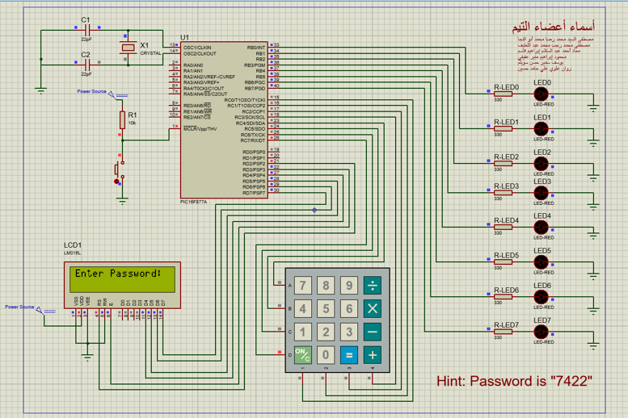

# Keypad Secured Toggle of a Micro-controller Port
 A university project on Micro-controllers, where the main idea is to secure the toggle of a port (port B).

 

## 😎 **Quick start**

 

### If you wanna go around everything, exploring the code as well, compiling it, etc. Then you would download [mikroC PRO for PIC](https://www.mikroe.com/mikroc-pic).

 

### But to just to give it a try, you can just do the simulation part:

###  First, [download](https://www.google.com/search?q=Proteus+8+Professional+download) Proteus 8 Professional, from one of these sources.

### Now all you gotta do, is to navigate to the `Project Simulation` folder and then run the `Keypad secured toggle of Port B - Simulation.pdsprj` file using Proteus.

 

### That's all you need to know to start, have fun! ✅

 

---
### I have provided a .pptx presentation ( `Summary - Keypad Password-Secured Toggle of Port B - Team 10.pptx` ) for this project that was used while submitting it for my university, hope it helps you knowing more about the project.
---

 

##  ⚒️ **Built with**

 

- [mikroC PRO for PIC](https://www.mikroe.com/mikroc-pic) - The mikroC PRO for PIC is a full-featured ANSI C compiler for PIC devices from Microchip®. It is the best solution for developing code for PIC devices. It features intuitive IDE, powerful compiler with advanced optimizations, lots of hardware and software libraries, and additional tools that will help you in your work.

- [Proteus 8 Professional](https://www.techulator.com/resources/15432-Proteus-8-Professional-a-useful-tool-for-electronic-engineers.aspx) Proteus 8 Professional is a software which can be used to draw schematics, PCB layout, code and even simulate the schematic. It is developed by Labcenter Electronic Ltd.

  

## 🚩 [License](https://github.com/mostafa-aboelnaga/Keypad-Secured-Toggle-of-a-Micro-controller-Port/blob/main/LICENSE)

MIT © [Mostafa Aboelnaga](https://github.com/mostafa-aboelnaga/)

